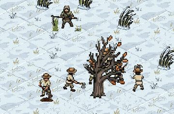
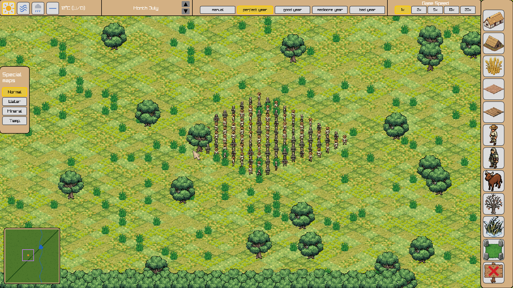

# Carolus

**Status: early development, not yet playable.**

An isometric medieval village builder, written in plain C with [raylib](https://www.raylib.com/).
Lay out fields and roads, grow crops through the seasons, react to soil and
weather, and watch farmers path their way across a living, real-time-driven
map.





## Features

- **Isometric tile map** water, roads, and arable land.
- **Seasons & weather**: a real-time global clock drives season-specific
  tile art (grass, oak trees, meadows) and weather scenarios (rain, clouds,
  puddles)
- **Farming simulation**: wheat growth is driven by cumulative water and
  mineral uptake from the soil, not simple threshold timers
- **Pathfinding**: A* movement with drag-to-build roads and road-preference
  routing
- **Figures**: crowd-aware movement via flow fields
- **Building & placement**: sidebar-driven construction of houses, barns,
  bridges, boundary stones, and more
- **Object system**: a tagged-union `Object` type unifies figures, wheat,
  puddles, and scenery under one map layer

## Game design

Set in an early-medieval manorial estate (Villikation): households (Familia)
settle Mansen, work assigned fields and forest, and owe tribute to the
Herrenhof. Details in [`Plan/GAME_DESIGN.md`](Plan/GAME_DESIGN.md).

## Tech stack

- C11
- [raylib](https://www.raylib.com/) for rendering and input
- Hand-written, per-type dynamic arrays
- Sprites produced via [pixellab.ai](https://www.pixellab.ai/)

## Building

```sh
cd src
make
./main
```

Requires `gcc`, `make`, `raylib`, and `X11` development headers installed.

## Project layout

```
src/
  a_star/       pathfinding
  drawing/      tile, object, and figure rendering
  farming/      crop growth model
  flood_fill/   contiguous-area selection
  map/          map data and setup
  mode/         interaction mode state machine
  seasons/      global time/season clock
  soil/         soil moisture and mineral simulation
  weather/      weather scenarios, clouds, puddles
  units/        farmers, animals
Images/         sprite assets (per-object, per-season variants)
Plan/           design roadmap and open questions
```

## Roadmap

Active work and open design questions are tracked in
[`Plan/TODO.md`](Plan/TODO.md).

## License

MIT - see [`LICENSE`](LICENSE). Image assets under `Images/` have their own
license, see [`Images/LICENSE`](Images/LICENSE).
